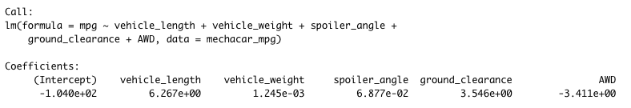
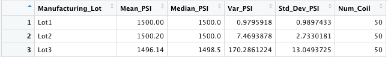
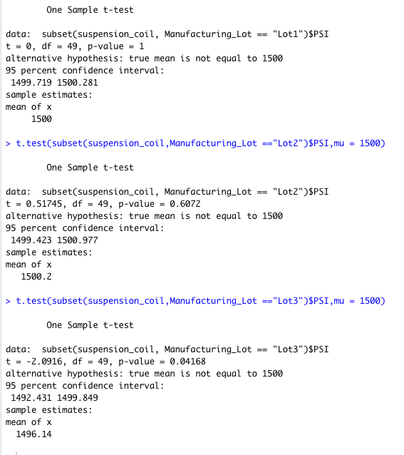

# MechaCar Statistical Analysis
## Linear Regression to Predict MPG
- The data set uses vehhicle length, weight, spoiler angle, ground clearance, and AWD(all-wheel drive). Of those listed only vehicle length and ground clearance are the non random variances. The other variables had higher p-values.
- For this linear model the slope would not be considered zero. 
- This model could be considered an effective at predicting the mpg because the data has a R squared value 0.7149 or 71%. That means 71% of the predictions will correct.

## Summary Statistics on Suspension Coils
From the summary total data the variance for the PSI came out to around 62. This means that it will not exceed the 100 PSI that was specified.
Unfortunately this was not the case when data was seperated by Lot number. As shown Lot 3 had a variance of 170 which is 70 higher than what the design specifications were asking for. On the other hand the first two had a significantly lower variance with Lot 1 at .97 and Lot 2 at 7.5.

## T-Tests on Suspension Coils
The results from this portion of the data show the p-values of Lot at 1, Lot 2 at 0.6072, Lot 3 at 0.04168 and the all of them together at 0.06028.

Of the three only Lot 3 shows that it is not up to par comparatively to the rest of the data with a p-value equal to 0.04168 which is under the standard of 0.05. With that known it could be suggested to remove Lot 3 to get better overall results.

## Study Design: MechaCar vs Competition
Some of the ways to compare the MechaCar vehicles performance to other manufacturer's vehicles would include cost, fuel efficiency, and safety ratings.
- The metrics tested that are listed above will show the average consumer how to simply compare these vehicles against eachother.
- The null hypothesis would be to sell it a fair price comparatively to the rest of the market. The alternative hypothesis would be to see if it is selling for an unfair price.
- Using a multiple linear regression would show the biggest breakdown between the variables and how it would impact the price for MechaCars and their competitors.
